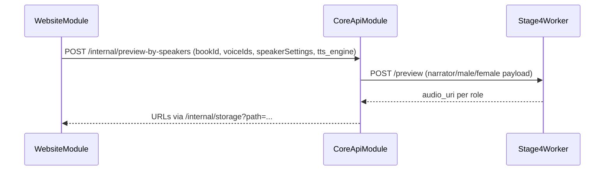

# CoreApiModule (FastAPI Core) — Техническое задание

## Назначение и ответственность

- **Что делает модуль**:
  - Принимает загрузки книг/текста и готовит материал для пайплайна.
  - Выполняет orchestration пайплайна stage1–stage5:
    - парсинг структуры,
    - назначение ролей,
    - нормализация и чанкинг,
    - формирование задач на синтез (Stage4),
    - сборка финального аудио.
  - Предоставляет API для статусов, превью, скачивания/стриминга артефактов.
- **Что модуль НЕ делает**:
  - Не выполняет inference TTS моделей (это Stage4 + TTS engines).

## Границы и зависимости

- **Код (as-is)**:
  - App: `app/main.py`, `app/api/app.py`
  - Routes: `app/api/routes/*.py`
  - Pipeline: `app/core/pipeline/*.py`
- **Зависимости**:
  - Stage4WorkerModule (as-is: HTTP; target: очередь Redis).
  - MinIO(S3) (target: артефакты), Postgres (target: SoT), Redis (target: очередь).

## Публичные контракты (as-is)

Точки входа включены в `app/api/app.py`:
- `/health`
- `/api/books/*` (`app/api/routes/books.py`)
- `/api/chapters/*` (`app/api/routes/chapters.py` — сейчас 503 stub)
- `/voices*` (`app/api/routes/voices.py`)
- `/books/*` и `/internal/*` (`app/api/routes/app_pipeline.py`)

### Book upload

`POST /api/books/upload`
- Headers:
  - `X-User-Id` (опционально; иначе `anonymous`)
  - `X-Project-Id` (опционально)
  - `X-Project-Title` (ограничение ASCII; для UTF-8 есть form field)
- Form:
  - `file` (.txt/.fb2/.epub/.mobi)
  - `project_title` (опционально)
- Ответ: `{ book_id, status="uploaded", chapters[] }`

### Voices

`GET /voices` — список встроенных и пользовательских голосов (по `X-User-Id`).

`POST /voices/upload` — загрузка WAV (требует `X-User-Id`, лимиты 5MB/30s).

`GET /voices/{voice_id}/sample` — отдать WAV.

`DELETE /voices/{voice_id}` — удалить пользовательский голос.

### Pipeline orchestration (as-is HTTP worker contract)

`POST /internal/process-book-stage4`
- Запускает stage1–stage3, формирует очередь задач для stage4 (in-memory).

`POST /internal/tts-next` / `POST /internal/tts-complete`
- Контракт выдачи задач и подтверждения выполнения для stage4 worker.

`POST /internal/preview-by-speakers`
- Превью по ролям narrator/male/female через stage4 `/preview`.

`GET /internal/storage?path=...`
- Отдаёт файл из локального `STORAGE_ROOT` (as-is).

## Target-контракты (что должно быть)

### 1) SoT в Postgres

CoreApiModule не хранит критичное состояние in-memory. В БД фиксируются:
- Book/Line структура,
- задания `taskId` (детерминированные),
- статусы/lease/retry,
- ссылки на S3 keys.

### 2) Очередь Core → Stage4

Core публикует сообщения в Redis-очередь (см. `PIPELINE_STAGE4_WORKER_MODULE.md`):
- payload содержит `clientId`, `taskId`, и ссылки на входные данные.

### 3) API выдачи артефактов по (clientId, taskId)

Core предоставляет read-API:
- `GET /tasks/{taskId}` → status + metadata
- `GET /artifacts/{taskId}` → stream/proxy WAV из S3 (или redirect/подписанный URL)

### 4) Идемпотентность

- `taskId` детерминированный: повторная постановка не создаёт дубликатов.
- `complete(taskId)` идемпотентен (повторные complete не ломают состояние).

## Конфигурация (as-is)

- `APP_STORAGE_ROOT` / `CORE_STORAGE_PATH`
- `APP_STAGE4_URL` (для preview, as-is)
- `CORS_ORIGIN_REGEX`

## Сценарии (use-cases)

### Превью по ролям (as-is)

## Критерии приёмки (target)

- [x] Core можно рестартить без потери очереди/прогресса/статусов.
- [x] Артефакты доступны через S3/MinIO, а не через локальный диск.
- [x] Контракты stage1..stage5 фиксированы и валидируются.

## Примечания по текущей реализации (as-is)

- In-memory: `_book_states`, `_pending_books` в `app/api/routes/app_pipeline.py`.
- Локальный storage: `app/storage/*` и выдача файлов через `/internal/storage`.

