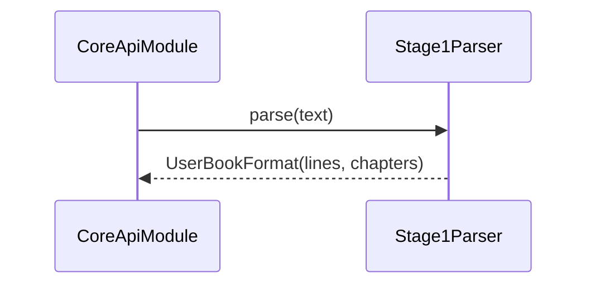

# PipelineStage1Module (структурный парсер) — Техническое задание

## Назначение и ответственность

- **Что делает модуль**:
  - Преобразует исходный текст книги в структурированное представление: главы/строки/типы строк.
  - Нормализует базовые артефакты структуры (например, заголовки глав, разметку).
- **Что модуль НЕ делает**:
  - Не назначает роли (это stage2).
  - Не выставляет эмоции (это stage3).
  - Не синтезирует аудио (stage4/tts).

## Границы и зависимости

- **Код (as-is)**: `app/core/pipeline/stage1_parser.py`, а также извлечение текста из форматов: `app/core/book_convert.py`.
- **Вход**: plaintext (например `extracted.txt`) в UTF-8.
- **Выход**: внутренний контракт `UserBookFormat`/`Line[]` (см. `app/core/models.py`).

## Публичные контракты

### Внутренний контракт данных (общий для пайплайна)

Инварианты (target):
- Каждая строка имеет:
  - **устойчивый logical id** (в рамках книги) *или* индекс (as-is `idx`) + порядок,
  - `original` (исходный текст),
  - `type` (например prose/dialogue/poem) — если поддерживается,
  - `chapter_id`, `is_chapter_header`.
- Парсер не должен генерировать пустые строки как задачи (пустые допускаются как структурные элементы, но должны быть отфильтрованы перед stage4).

## Нефункциональные требования

- **Детерминированность**: одинаковый входной текст → одинаковая структура (в рамках версии парсера).
- **Производительность**: парсинг книги до N символов выполняется за приемлемое время (лимит задаётся на уровне API).

## Сценарии (use-cases)

### Парсинг книги для пайплайна

## Критерии приёмки

- [x] Парсер корректно выделяет главы/строки на типичных русскоязычных книгах.
- [x] Выходной контракт валидируется (schema/типами) перед передачей в stage2.

