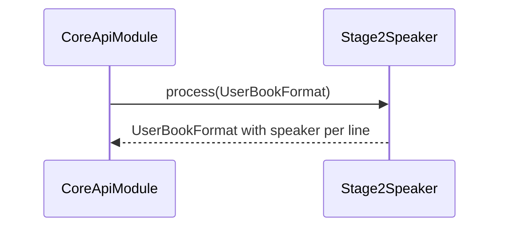

# PipelineStage2Module (роли/спикеры/контекст + чанкинг) — Техническое задание

## Назначение и ответственность

- **Что делает модуль**:
  - Назначает каждой строке роль/спикера (минимум: `narrator|male|female`).
  - Выполняет контекстные/эвристические правила (словарь глаголов, evidence collectors/resolvers, fallback).
  - Делает постобработку: группировка по спикеру/главам, разбиение на чанки.
- **Что модуль НЕ делает**:
  - Не выставляет эмоциональные параметры (stage3).
  - Не запускает TTS.

## Границы и зависимости

- **Код (as-is)**:
  - `app/core/pipeline/stage2_speaker.py`
  - подпроцессы: `stage2_0_verb_dictionary.py`, `stage2_1_evidence_collectors.py`, `stage2_2_evidence_resolver.py`, `stage2_3_context_manager.py`, `stage2_4_fallback_strategies.py`
  - постобработка: `stage2_post_chunk.py`
- **Вход**: `UserBookFormat` после stage1.
- **Выход**: `UserBookFormat` с заполненным `speaker`/`role` и подготовленным для stage3/stage4 текстом/чанками.

## Публичные контракты

### Роли/спикеры

Target-минимум:
- `role ∈ {narrator, male, female}`.
- Наличие `speaker` обязательно для каждой строки с непустым текстом.

### Чанкинг

Требования (target):
- Чанки ограничены по длине, чтобы не “ронять” TTS.
- Чанкинг не должен ломать порядок воспроизведения.
- При разбиении строки на части должна сохраняться связь частей с logical line (для последующей сборки).

## Нефункциональные требования

- **Детерминированность**: stage2 не использует случайность.
- **Интерпретируемость**: модуль должен уметь выдавать “почему выбран male/female/narrator” (для отладки и улучшений).

## Сценарии (use-cases)

### Назначение ролей

## Критерии приёмки

- [x] Для типичных диалогов роли выделяются корректно (базовый уровень).
- [x] Для строк без явной роли используется `narrator` (fallback).
- [x] Чанкинг удовлетворяет ограничениям TTS (максимальная длина, порядок).

