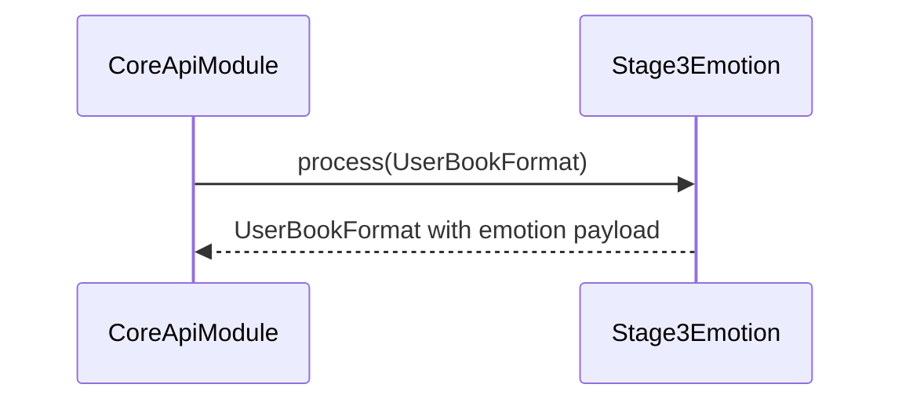

# PipelineStage3Module (эмоции/речевая режиссура) — Техническое задание

## Назначение и ответственность

- **Что делает модуль**:
  - Проставляет параметры речи (минимум: `tempo`, `pitch`; опционально: energy/pauses).
  - Применяет правила речевой режиссуры на уровне строк/чанков (интонация, темп, паузы).
- **Что модуль НЕ делает**:
  - Не меняет смысл текста (кроме допустимой нормализации для TTS).
  - Не синтезирует аудио.

## Границы и зависимости

- **Код (as-is)**:
  - `app/core/pipeline/stage3_emotion.py`
  - `app/core/pipeline/stage3_speech_director.py`
  - конфиги сигналов: `app/config/emotion_signals.yaml`
- **Вход**: `UserBookFormat` после stage2.
- **Выход**: `UserBookFormat` с `emotion` payload на строках/чанках.

## Публичные контракты

### Emotion payload (минимум)

Target:
- `tempo`: float (обычно 0.5–2.0)
- `pitch`: float (например −1..1 или в “полутонах”; шкала фиксируется в контракте)

Ас-is примеры в Core передаются в Stage4 как:
- `emotion: { tempo, pitch }` (см. `app/api/routes/app_pipeline.py` — `_speaker_settings_to_emotion`).

## Нефункциональные требования

- **Устойчивость**: эмоции не должны приводить к систематическим сбоям TTS (слишком экстремальные параметры).
- **Конфигурируемость**: правила эмоций задаются конфигом/настройками проекта, а не хардкодом.

## Сценарии (use-cases)

## Критерии приёмки

- [x] `tempo/pitch` заполняются для всех строк с текстом.
- [x] Значения ограничиваются разумным диапазоном (clamp).
- [x] При одинаковом входе и конфиге — одинаковый выход.

