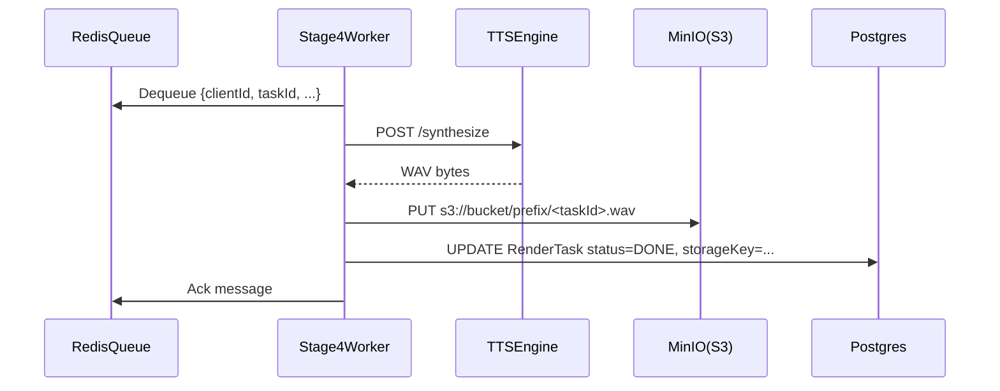

# PipelineStage4WorkerModule (TTS worker) — Техническое задание

## Назначение и ответственность

- **Что делает модуль**:
  - Забирает задачи синтеза речи из очереди.
  - Вызывает выбранный TTS engine (Qwen3 / XTTS2) и получает WAV.
  - Записывает артефакт в S3/MinIO.
  - Обновляет статус задачи в Postgres и публикует событие “готово” (или делает ack в очереди).
- **Что модуль НЕ делает**:
  - Не определяет структуру книги/роли/эмоции (это stage1–stage3).
  - Не хранит SoT (только пишет артефакты и статусы через Core/DB).

## Границы и зависимости

- **Код (as-is)**: `app/stage4_service/*`
- **Зависимости**:
  - Очередь (target: Redis queue).
  - Postgres (status updates).
  - S3/MinIO (WAV artifacts).
  - TTS engine service:
    - Qwen3: `app/tts_engine_service/app.py` (порт 8020)
    - XTTS2: `app/tts_engine_xtts/*` (порт 8021)

## Канонический идентификатор задачи

- **Ключ**: `(clientId, taskId)` — **taskId детерминированный**.
- **Идемпотентность**:
  - Повторное выполнение одного и того же `taskId` допустимо, но должно приводить к одному и тому же “логическому” результату (или перезаписи в том же storageKey).
  - Запись статуса `DONE`/`FAILED` должна быть идемпотентной.

## Target: контракты очереди

### Queue: `tts.render.v1` (пример)

**Message schema**:
- `clientId: string`
- `taskId: string` (deterministic)
- `engine: "qwen3" | "xtts2"`
- `text: string`
- `speaker: string` (роль или voiceId)
- `speakerWavRef?: { bucket, key } | { url }` (если требуется voice clone)
- `emotion?: { tempo?: number, pitch?: number, energy?: number }`
- `audioConfig?: object` (движко-специфичные параметры)
- `output: { bucket: string, key: string, contentType: "audio/wav" }`
- `createdAt: number`

**Retry/backoff**:
- Connection errors/503: ограниченные повторы, затем DLQ.

**Ordering**:
- порядок задач не гарантируется; сборка главы/книги должна работать с out-of-order готовностью.

## As-is: HTTP polling контракт (для справки)

Текущая реализация воркера:
- `POST /tts` — выполнить задачу, вернуть `audio_uri` (локальный storage)
- фоновый polling:
  - Core `POST /internal/tts-next`
  - Core `POST /internal/tts-complete`

## Нефункциональные требования (target)

- **Timeouts**:
  - engine-specific timeouts (XTTS может быть очень долгим).
- **Stability**:
  - ретраи на 503 при “model loading”.
- **Observability**:
  - логировать `clientId`, `taskId`, engine, latency, размер WAV, outcome.

## Сценарии (use-cases)

### Выполнение задачи TTS (target)

## Критерии приёмки

- [x] Worker безопасно переживает рестарт (не теряет задачи; повтор не ломает идемпотентность).
- [x] Ошибки TTS корректно помечаются как FAILED и уходят в DLQ после лимита.

