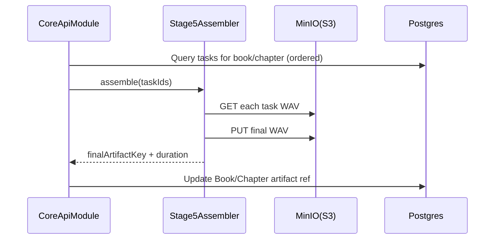

# PipelineStage5AssemblerModule (сборка финального аудио) — Техническое задание

## Назначение и ответственность

- **Что делает модуль**:
  - Собирает финальный аудиофайл из набора WAV артефактов задач.
  - Поддерживает сборку:
    - полного аудио книги,
    - аудио отдельных глав,
    - (опционально) глав с оглавлением/переходами.
- **Что модуль НЕ делает**:
  - Не создаёт задачи TTS.
  - Не синтезирует речь.

## Границы и зависимости

- **Код (as-is)**: `app/core/pipeline/stage5_tts.py` (класс `Stage5Assembler`).
- **Вход (target)**:
  - список `taskId` в нужном порядке (или список logical lines + map taskId parts),
  - ссылки на артефакты WAV в S3/MinIO.
- **Выход**:
  - финальный WAV артефакт (S3 key) + метаданные (duration, chapters mapping).

## Публичные контракты

### Артефакт “final”

Target:
- `ArtifactType = "book.final.wav" | "book.chapter.wav"`
- хранится в S3 prefix модуля Core (или отдельного Assembly prefix).

### Idempotency

Сборка по одному и тому же набору входных `taskId` должна быть идемпотентной:
- либо детерминированный `assemblyId` (hash inputs),
- либо отдельная сущность AssemblyTask с dedupeKey.

## Нефункциональные требования

- **Корректность**: порядок строк/частей не должен нарушаться.
- **Производительность**: сборка больших книг должна быть потоковой, без загрузки всего в память.
- **Аудио параметры**: фиксировать sample rate/bit depth (или нормализовать к стандарту).

## Сценарии (use-cases)

## Критерии приёмки

- [x] Можно собрать финальный WAV, даже если задачи были выполнены out-of-order.
- [x] Сборка не зависит от локального диска.

## Примечания по текущей реализации (as-is)

Сейчас Core собирает `final.wav` локально в `app/storage/books/...` и отдаёт через `/books/:id/download`. Target: перенести на S3/MinIO и индексировать в Postgres.

