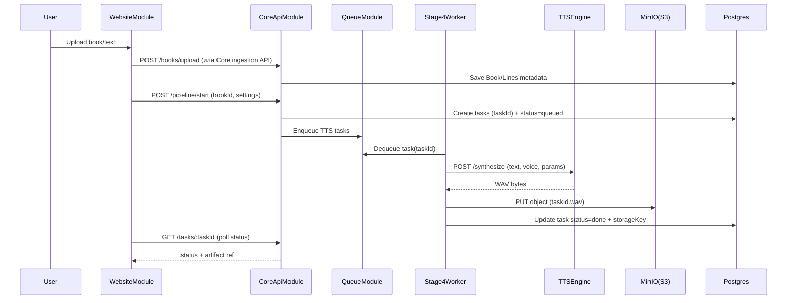

# System Overview — NeiroCthec

## Цель системы

Преобразовать загруженную книгу/текст в озвученный аудиофайл (и/или главы) с поддержкой:
- выбора голосов по ролям (narrator/male/female и кастомные),
- нормализации и разбиения текста на задачи TTS,
- асинхронной генерации,
- хранения артефактов в S3/MinIO и статусов в Postgres.

## Модули (target)

1) **WebsiteModule (Next.js + NestJS)**  
UI и публичный API для пользователей: авторизация, проекты, запуск генерации, просмотр статусов, проигрывание/скачивание.

2) **CoreApiModule (FastAPI)**  
Оркестрация пайплайна stage1–stage5, формирование задач TTS, управление статусами, выдача артефактов по API.

3) **QueueModule (Redis)**  
Контракт очередей/событий, гарантии доставки, повторные попытки, DLQ.

4) **Stage4WorkerModule**  
Консьюмер очереди задач TTS: получает задачу (`taskId`), вызывает TTS engine, пишет WAV в S3, обновляет статусы.

5) **TTS engines**  
`TTS_Qwen3_Engine_Module` и `TTS_XTTS2_Engine_Module` — синтез речи из текста в WAV.

6) **InfraModule**  
Postgres (SoT), Redis, MinIO.

7) **StorageConventionsModule**  
Соглашения по bucket/prefix/key, форматам, TTL/retention.

## Канонические идентификаторы (target)

- **clientId**: идентификатор клиента/тенанта (минимум: пользователь; возможно: организация).
- **taskId**: детерминированный идентификатор задачи синтеза/рендера (см. `PIPELINE_STAGE4_WORKER_MODULE.md`).

Принцип: артефакты выдаются по **(clientId, taskId)**.

## Ключевые сценарии

### 1) Загрузка книги и запуск генерации

### 2) Превью голосов по ролям

WebsiteModule запрашивает превью через CoreApiModule; Core формирует 3 маленькие задачи (narrator/male/female) и получает WAV через TTS.

### 3) Сборка финального аудио

Core, имея список `taskId` по книге/главе, собирает итоговый WAV (stage5) и сохраняет артефакт (S3 key), обновляя статус в DB.

## Нефункциональные требования (общие)

- **Рестартоустойчивость**: прогресс/очередь/lease не теряются при рестартах Core/Stage4.
- **Идемпотентность**: повторная обработка одного и того же `taskId` не должна порождать дубликаты артефактов и несогласованные статусы.
- **Изоляция клиента**: `clientId` используется во всех ключах, запросах и проверках доступа.

## Примечания по текущей реализации (as-is)

Сейчас часть состояния хранится in-memory в Core (`app/api/routes/app_pipeline.py`) и артефакты на локальном диске `app/storage/`. Это описано в соответствующих модульных ТЗ как текущее ограничение и направление миграции.

