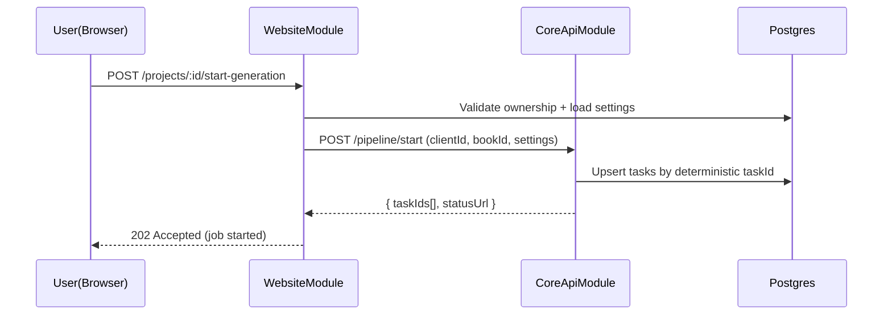

# WebsiteModule (Next.js + NestJS) — Техническое задание

## Назначение и ответственность

- **Что делает модуль**:
  - Предоставляет UI (Next.js) и публичный HTTP API (NestJS) для пользователей.
  - Управляет аутентификацией/сессиями, профилем, проектами.
  - Запускает сценарии генерации аудио и отображает прогресс/статусы.
  - Проксирует запросы к Core API, когда это нужно в браузере (для обхода CORS/rewrites ограничений).
- **Что модуль НЕ делает**:
  - Не реализует TTS/пайплайн обработки текста внутри себя (это Core/Stage4/TTS).

## Границы и зависимости

- **Код**:
  - UI: `frontend/apps/web/*`
  - Backend API: `frontend/apps/api/*`
- **Зависимости**:
  - Postgres (через Prisma, Nest).
  - Redis (BullMQ jobs в Nest).
  - MinIO(S3) (для хранения аудио, через Nest proxy stream).
  - Core API (HTTP).

## Публичные контракты (as-is)

Источник MVP-контрактов: `frontend/apps/api/API.md`.

### Nest API (порт 4000)

Минимальный набор:
- **Auth**: `/api/auth/register|login|me|refresh|logout`
- **Users**: `/api/users/me`, `/api/users/me/voices*`
- **Projects**: `/api/projects*` (CRUD + voiceSettings/speakerSettings)
- **Audios**:
  - `POST /api/projects/:id/generate-audio`
  - `GET /api/audios/:id/stream` (Range supported)
- **Voices**: `/api/voices*` (каталог + sample)
- **Admin/Health/Subscription/Books/Jobs/Storage**: см. `frontend/apps/api/src/modules/*`

### Next.js proxy к Core (порт 3000)

- **Прокси all methods**: `/app-api/*` → Core API  
  Реализация: `frontend/apps/web/app/app-api/[[...path]]/route.ts` (таймаут 5 минут на долгие запросы).
- Доп. прокси/роуты загрузки:
  - `frontend/apps/web/app/upload-book/route.ts`
  - `frontend/apps/web/app/app/proxy-core/books/upload/route.ts`

## Target-контракты (что должно быть)

### 1) Публичный API модуля

WebsiteModule публикует:
- API для управления доменными сущностями (Projects/Books/Voices/Tasks/Artifacts).
- API для чтения статусов по `taskId` и получения ссылок на артефакты.

### 2) Интеграция с CoreApiModule

- WebsiteModule **может** вызывать Core API напрямую сервер-сервер (Nest backend) и/или через Next proxy для браузера.
- Должна быть чёткая политика:
  - **Browser → Website only** (предпочтительно),
  - или **Browser → Core** допускается для некоторых read-only endpoints.

## Конфигурация (as-is)

Web (`frontend/apps/web/.env.example`):
- `NEXT_PUBLIC_API_BASE_URL`
- `NEXT_PUBLIC_APP_API_URL` (Core URL или `proxy`)
- `APP_API_PROXY_TARGET` / `CORE_API_URL` (для server-side proxy)

Nest (`frontend/apps/api/.env.example` + переменные в `docker-compose.yml`):
- `DATABASE_URL`, `REDIS_URL`, `S3_ENDPOINT`, `APP_API_URL|CORE_API_URL`
- `JWT_ACCESS_SECRET`, `JWT_REFRESH_SECRET`
- `CORS_ORIGINS` или `CORS_ORIGIN_REGEX`

## Нефункциональные требования (target)

- **Security**:
  - UI и Nest API — публичные.
  - Все вызовы к Core API — с чёткой auth/tenant изоляцией.
- **Observability**:
  - correlationId/requestId в логах и прокси.
- **Reliability**:
  - повтор запросов при 502/504 на прокси к Core (ограниченно, без дублирования задач).

## Сценарии (use-cases)

### Сценарий: запуск генерации (target)

## Критерии приёмки (target)

- [x] Все основные пользовательские действия выполняются через WebsiteModule.
- [x] WebsiteModule умеет получить статус и артефакт по `taskId` без доступа к локальному диску Core.

